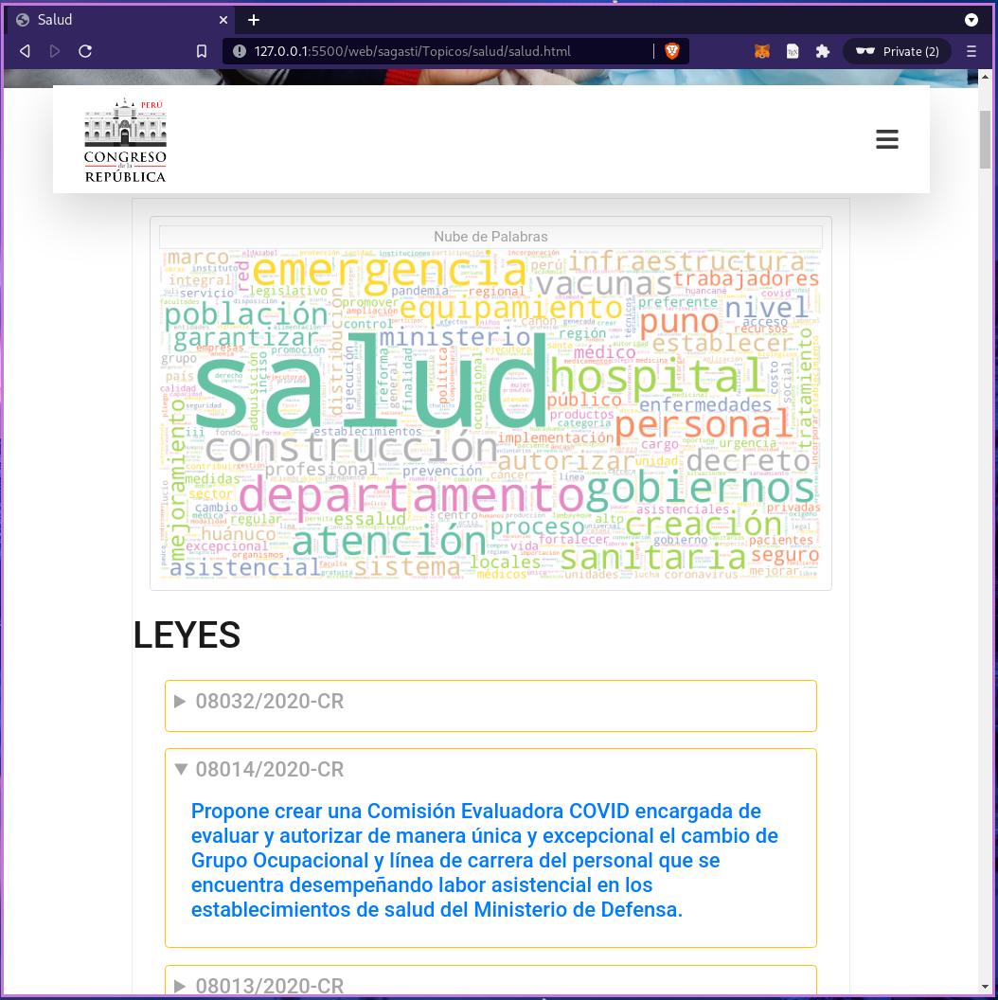

<h1 align="center">
	
</h1>

<h3 align="center">
	Improve transparency peruvian laws - PLN
</h3>

<p align="center">
	<strong>
		<a href="https://transparencia-leyes-peruanas.herokuapp.com/">Website</a>
		•
		<a href="https://github.com/bladhl/improve-transparency-peruvian-laws-nlp/tree/main/datasets">Docs</a>
	</strong>
</p>


<p align="center">
	
</p>
<p align="center">
	
</p>

# Final Project
-   National University of San Antonio Abad in Cusco
-   Computer and Systems Engineering -  [In.UNSAAC](http://in.unsaac.edu.pe/home/).
-   Natural Language Processing - Group 3
#### Teacher:
-   Roxana Lisette Quintanilla Portugal  -  [Concytec](http://dina.concytec.gob.pe/appDirectorioCTI/VerDatosInvestigador.do;jsessionid=f564431f36070c2b4a0e4a590b74?id_investigador=40930).

## :pushpin: Overview


In this project we classifier Peruvian laws in topic, and we show word cloud for each period Peruvian presidents since 2016. We use natural language processing techniques to generate the word cloud as well as a semantic network.

## :pushpin: Installation and usage

-   pip3 install --user --upgrade git+[https://github.com/twintproject/twint.git@origin/master#egg=twint](https://github.com/twintproject/twint.git@origin/master#egg=twint)
-   pip install selenium
-   pip install --upgrade transformers 
-   pip install spacy
-   python -m spacy download es_core_news_sm
-   pip install sklearn

For the scrapping requires download [chromedriver](https://chromedriver.chromium.org) you shoud change the path direction of chromedriver in the code.

Install all requirements:
```sh
pip install -r requirements.txt 
```

### :pushpin: Website Repository

Please refer to the [website](https://github.com/bladhl/improve-transparency-peruvian-laws-nlp/tree/main/web).

### :pushpin: Running from source

The following commands install and run the development version of the project:

```sh
git clone https://github.com/bladhl/improve-transparency-peruvian-laws-nlp
cd improve-transparency-peruvian-laws-nlp/python/src/
```
An example for scrapping:
```sh
python scrapping.py
```

While it is the most recent codebase, this is not production-ready! Run at
your own risk. It is also not recommended to run this as root.

## :pushpin: Development setup

Simply follow the instructions to run the porject from source above, on your own
fork.
Before submitting any change, make sure to:

- Look at the open and closed issues to see if this was not already discussed before. If you can't see any, feel free to [open a issue](https://github.com/bladhl/improve-transparency-peruvian-laws-nlp/issues/new).
- If you think you discovered a vulnerability, do not open a public issue on GitHub.

## :pushpin: Authors

-   Choque Bueno Fiorella  -  [FioChoque](https://github.com/FioChoque)
-   Condori Ccarhuarupay Bruno Moises  -  [cbruno205](https://github.com/cbruno205)
-   Huaman Guevara Alexander Javier  -  [Alexanderhg222](https://github.com/Alexanderhg222)
-   Huaraya Chara Bladimir  -  [bladhl](https://github.com/bladhl)
-   Rojas Cahuana Etson Ronaldao  -  [etson32](https://github.com/etson32)
-   Tacusi Larota Jhon  -  [jhontacusi](https://github.com/jhontacusi)
-   Ttito Quilca Cesar Rodrigo  -  [cesarodrigo21](https://github.com/cesarodrigo21)
-   Vargas Arqque Jeremyk Rufino  -  [jeremva3](https://github.com/jeremva3)
